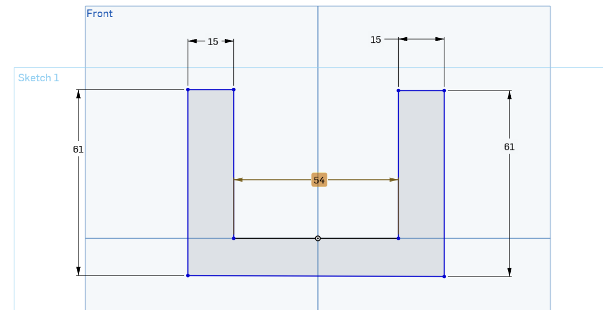
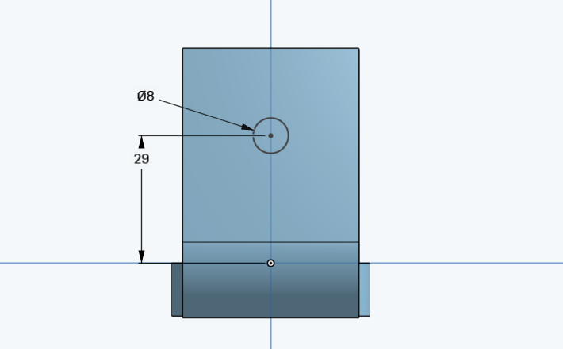
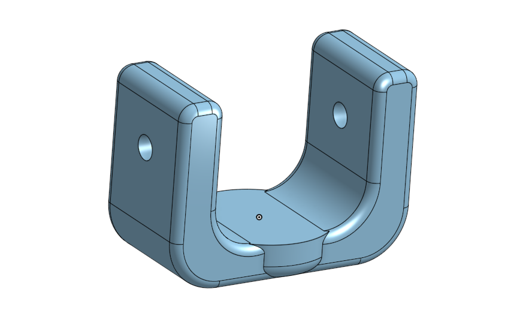

# Robot Arm Joint

This project focuses on the mechanical design of a robotic arm joint.This mechanical part is designed with precise dimensional constraints.

- **54 mm between the vertical sides.**
   
   
   
- **a mounting hole on walls positioned 29 mm from the bottom.**
   
   
   

## Final View 
Below is a visual representation of the final part:
    
   
   
